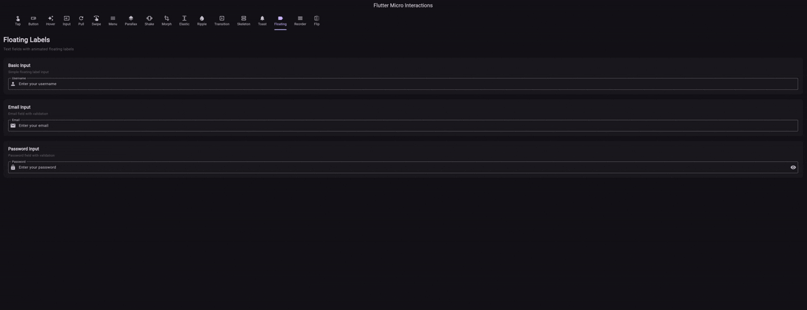

# Flutter Micro Interactions



A collection of pre-built micro-interactions and animations for Flutter apps. Make your app feel more responsive and engaging with minimal effort. This package provides easy-to-use widgets that add professional animations to your Flutter application.

## Features

- Tap Feedback Animations
- Button State Transitions
- Hover Effects
- Input Focus Animations
- Pull to Refresh
- Swipe Actions
- Long Press Menu
- Parallax Scroll
- Shake to Action
- Morphing Shapes
- Elastic Scroll
- Ripple Effect
- Page Transitions
- Loading Skeletons
- **Toast Notifications** (Animated, multiple styles)
- **Floating Label Animation** (Smooth, with validation)
- **Reorderable List Animation** (Drag & drop with feedback)
- **Card Flip Animation** (3D flip with perspective)

## Preview

See below for a preview of the package in action:


## Installation

Add this to your package's `pubspec.yaml` file:

```yaml
dependencies:
  flutter_micro_interactions: ^0.0.2
```

## Usage

### Tap Feedback

Add pulse, bounce, scale, or fade effects to any widget:

```dart
// Scale effect
TapFeedback.scale(
  child: ElevatedButton(
    onPressed: () {},
    child: Text('Scale Effect'),
  ),
);

// Bounce effect
TapFeedback.bounce(
  child: ElevatedButton(
    onPressed: () {},
    child: Text('Bounce Effect'),
  ),
);

// Fade effect
TapFeedback.fade(
  child: ElevatedButton(
    onPressed: () {},
    child: Text('Fade Effect'),
  ),
);

// Combined scale and opacity
TapFeedback.scaleAndOpacity(
  child: ElevatedButton(
    onPressed: () {},
    child: Text('Combined Effect'),
  ),
);
```

### Button States

Create beautiful state transitions for your buttons:

```dart
ButtonStates.withTransitions(
  child: ElevatedButton(
    onPressed: () {},
    child: Text('Submit'),
  ),
  onLoading: () => CircularProgressIndicator(),
  onSuccess: () => Icon(Icons.check),
  onError: () => Icon(Icons.error),
);
```

### Hover Effects

Add desktop/web hover effects:

```dart
HoverGlow(
  child: ElevatedButton(
    onPressed: () {},
    child: Text('Hover Me!'),
  ),
);
```

### Input Focus

Animate your input fields when they receive focus:

```dart
InputFocus.animate(
  child: TextField(
    decoration: InputDecoration(
      labelText: 'Username',
      hintText: 'Enter your username',
      prefixIcon: Icon(Icons.person),
      border: OutlineInputBorder(),
    ),
  ),
);
```

### Pull to Refresh

Add pull-to-refresh functionality to any scrollable widget:

```dart
PullToRefresh(
  onRefresh: () async {
    // Fetch new data here
    await Future.delayed(Duration(seconds: 1));
  },
  child: ListView.builder(
    itemCount: 20,
    itemBuilder: (context, index) => ListTile(
      title: Text('Item $index'),
    ),
  ),
);
```

### Swipe Actions

Add swipe actions to list items:

```dart
SwipeActions(
  leftActions: [
    SwipeAction.favorite(onPressed: () {
      // Handle favorite action
    }),
  ],
  rightActions: [
    SwipeAction.delete(onPressed: () {
      // Handle delete action
    }),
  ],
  child: ListTile(
    title: Text('Swipe me left or right'),
  ),
);
```

### Long Press Menu

Show a context menu on long press:

```dart
LongPressMenu(
  menuItems: [
    MenuItem.copy(onTap: () {
      // Handle copy action
    }),
    MenuItem.share(onTap: () {
      // Handle share action
    }),
    MenuItem.delete(onTap: () {
      // Handle delete action
    }),
  ],
  child: Card(
    child: Padding(
      padding: EdgeInsets.all(16),
      child: Text('Long press me to see the menu'),
    ),
  ),
);
```

### Parallax Scroll

Create parallax scrolling effects:

```dart
ParallaxScroll(
  background: Image.asset(
    'assets/background.jpg',
    fit: BoxFit.cover,
  ),
  foreground: Column(
    children: [
      SizedBox(height: 200),
      Text('Parallax Title', style: TextStyle(fontSize: 24)),
      // More content here
    ],
  ),
);
```

### Shake to Action

Detect shake gestures and trigger actions:

```dart
ShakeToAction(
  onShake: () {
    // Handle shake action
    ScaffoldMessenger.of(context).showSnackBar(
      SnackBar(content: Text('Shake detected!')),
    );
  },
  child: Card(
    child: Padding(
      padding: EdgeInsets.all(16),
      child: Text('Shake me!'),
    ),
  ),
);
```

### Morphing Shapes

Animate between different shapes:

```dart
MorphingShapes(
  shapes: [
    ShapeType.circle,
    ShapeType.square,
    ShapeType.triangle,
    ShapeType.star,
  ],
  autoPlay: true,
  color: Colors.blue,
  size: Size(100, 100),
);
```

### Elastic Scroll

Add elastic scrolling behavior:

```dart
ElasticScroll(
  elasticity: 0.3,
  child: ListView.builder(
    itemCount: 20,
    itemBuilder: (context, index) => ListTile(
      title: Text('Item $index'),
    ),
  ),
);
```

### Ripple Effect

Add ripple effects to any widget:

```dart
RippleEffect(
  rippleColor: Colors.blue.withOpacity(0.3),
  child: Container(
    width: 200,
    height: 200,
    color: Colors.blue.shade100,
    alignment: Alignment.center,
    child: Text('Tap me for ripple effect'),
  ),
);
```

### Page Transitions

Add custom transitions between pages:

```dart
Navigator.of(context).push(
  PageTransition(
    type: PageTransitionType.fade,
    child: DetailScreen(),
  ),
);
```

### Loading Skeletons

Show loading skeletons while content is loading:

```dart
SkeletonLoader(
  loading: isLoading,
  skeleton: CardSkeleton(
    hasImage: true,
    titleLines: 1,
    subtitleLines: 2,
  ),
  child: YourActualCard(),
);
```

### Toast Notifications

Show animated toast notifications with different styles:

```dart
context.showToast(
  message: 'Operation completed successfully!',
  type: ToastType.success,
);
```

### Floating Label Animation

Animated floating label with validation:

```dart
FloatingLabel(
  label: 'Email',
  hint: 'Enter your email',
  validator: (value) {
    if (value == null || value.isEmpty) {
      return 'Email is required';
    }
    if (!value.contains('@')) {
      return 'Please enter a valid email';
    }
    return null;
  },
);
```

### Reorderable List Animation

Drag and drop to reorder items with smooth feedback:

```dart
ReorderableList(
  children: items.map((item) => ListTile(title: Text(item))).toList(),
  onReorder: (oldIndex, newIndex) {
    setState(() {
      if (oldIndex < newIndex) newIndex -= 1;
      final item = items.removeAt(oldIndex);
      items.insert(newIndex, item);
    });
  },
);
```

### Card Flip Animation

Flip cards with 3D perspective:

```dart
CardFlip(
  front: Card(child: Text('Front')),
  back: Card(child: Text('Back')),
);
```

## Examples

Run the example app to see all interactions in action:

```bash
cd example
flutter run
```

The example app showcases:
- All micro-interactions listed above

## Platform Support

- ✅ iOS
- ✅ Android
- ✅ Web
- ✅ macOS
- ✅ Windows
- ✅ Linux
